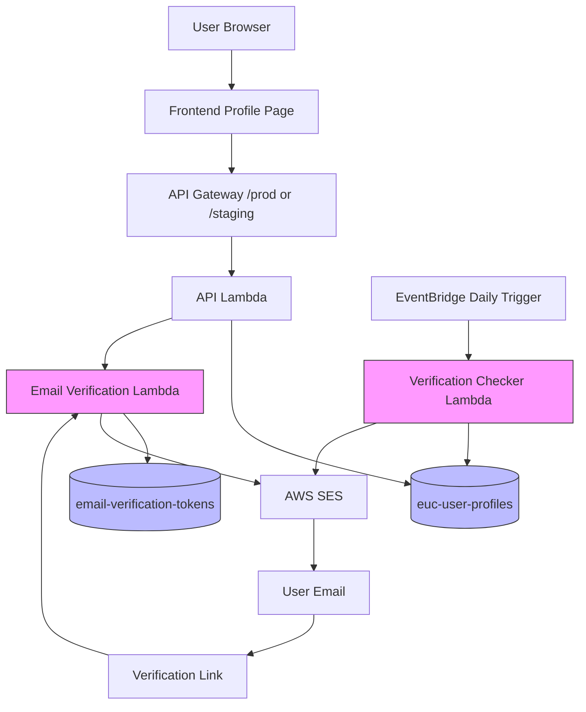

# Design Document: Amazon Email Verification

## Overview

The Amazon Email Verification system enables Amazon employees to verify their @amazon.com email addresses to gain administrative privileges on the EUC Content Hub platform. The design leverages AWS serverless services (Lambda, DynamoDB, SES) to provide a secure, scalable, and maintainable solution with automatic expiration management.

**Key Design Principles:**
- **Security First**: Cryptographically secure tokens, time-limited access, automatic expiration
- **Zero Trust**: Verify on every admin action, never cache verification status
- **Automatic Cleanup**: DynamoDB TTL and scheduled checks handle expiration without manual intervention
- **Environment Isolation**: Staging and production environments are completely separate
- **Audit Trail**: All verification actions are logged for security and compliance

## Architecture

### System Components



### Data Flow

**Verification Initiation Flow:**
1. User enters @amazon.com email in profile page
2. Frontend sends POST request to `/verify-email` endpoint
3. API Lambda validates email format (server-side)
4. API Lambda invokes Email Verification Lambda
5. Verification Lambda generates secure token
6. Token stored in DynamoDB with 1-hour TTL
7. SES sends verification email with token link
8. User receives email and clicks link

**Verification Confirmation Flow:**
1. User clicks verification link with token parameter
2. Request routed to Email Verification Lambda
3. Lambda validates token exists and not expired
4. Lambda updates user profile with verification status
5. Lambda marks token as consumed
6. User redirected to profile page with success message

**Expiration Check Flow:**
1. EventBridge triggers Verification Checker Lambda daily at 00:00 UTC
2. Checker scans all user profiles for verification status
3. For verifications expiring in 7 days: send reminder email
4. For expired verifications: revoke admin status
5. Update user profiles with new status

**Admin Action Authorization Flow:**
1. User attempts admin action (e.g., delete comment)
2. API Lambda checks user's verification status
3. If expired or missing: return 403 Forbidden
4. If valid: proceed with admin action

## Components and Interfaces

### 1. Email Verification Lambda

**Purpose**: Handle verification token generation, email sending, and token validation.

**Function Name**: `amazon-email-verification`

**Handler**: `email_verification_lambda.lambda_handler`

**Environment Variables:**
- `TABLE_SUFFIX`: Empty for production, `-staging` for staging
- `SENDER_EMAIL`: Verified SES sender address (stetlers@amazon.com)
- `FRONTEND_URL`: Base URL for verification links (https://awseuccontent.com or https://staging.awseuccontent.com)

**IAM Permissions:**
- DynamoDB: PutItem, GetItem, UpdateItem on `email-verification-tokens` table
- DynamoDB: UpdateItem on `euc-user-profiles` table
- SES: SendEmail permission
- CloudWatch: Logs write permission

**API Endpoints:**

```python
# POST /verify-email
# Request body: {"email": "user@amazon.com"}
# Response: {"success": true, "message": "Verification email sent"}

# GET /verify-email?token=<token>
# Response: Redirect to profile page with success/error message
```

**Core Functions:**

```python
def generate_verification_token() -> str:
    """Generate cryptographically secure 32-byte token"""
    return secrets.token_urlsafe(32)

def send_verification_email(email: str, token: str, frontend_url: str):
    """Send verification email via SES with token link"""
    verification_link = f"{frontend_url}/verify?token={token}"
    # Email template with link and 1-hour expiration notice

def validate_token(token: str) -> dict:
    """Validate token exists, not expired, not consumed"""
    # Query DynamoDB for token
    # Check expiration timestamp
    # Check consumed flag
    # Return validation result

def update_user_verification(user_id: str, email: str):
    """Update user profile with verification status"""
    expiration_date = datetime.now() + timedelta(days=90)
    # Update euc-user-profiles with verification data
```

### 2. Verification Checker Lambda

**Purpose**: Daily scheduled job to check verification expiration and send reminders.

**Function Name**: `amazon-email-verification-checker`

**Handler**: `verification_checker_lambda.lambda_handler`

**Trigger**: EventBridge rule (cron: `cron(0 0 * * ? *)` - daily at 00:00 UTC)

**Environment Variables:**
- `TABLE_SUFFIX`: Empty for production, `-staging` for staging
- `SENDER_EMAIL`: Verified SES sender address

**IAM Permissions:**
- DynamoDB: Scan, UpdateItem on `euc-user-profiles` table
- SES: SendEmail permission
- CloudWatch: Logs write permission

**Core Functions:**

```python
def check_expiring_verifications():
    """Scan for verifications expiring in 7 days"""
    # Scan euc-user-profiles for amazon_verified_until field
    # Calculate days until expiration
    # Return list of users needing reminders

def send_reminder_email(email: str, expiration_date: str):
    """Send reminder email 7 days before expiration"""
    # Email template with expiration date and re-verification link

def expire_verifications():
    """Revoke expired verifications"""
    # Scan for verifications past expiration date
    # Update user profiles to remove verification status
    # Log expiration events
```

### 3. API Lambda Updates

**New Endpoint**: `/verify-email`

**Methods**: POST (initiate), GET (confirm)

**Authentication**: POST requires JWT token, GET is public (token-based auth)

**Handler Functions:**

```python
def handle_verify_email_post(event, body):
    """Initiate email verification"""
    user_id = event['user']['sub']
    email = body.get('email')
    
    # Validate email ends with @amazon.com
    if not email.endswith('@amazon.com'):
        return error_response(400, "Only @amazon.com emails allowed")
    
    # Invoke Email Verification Lambda
    # Return success response

def handle_verify_email_get(event):
    """Confirm email verification"""
    token = event['queryStringParameters'].get('token')
    
    # Invoke Email Verification Lambda for validation
    # Return redirect response
```

**Admin Authorization Helper:**

```python
def check_admin_authorization(user_id: str) -> bool:
    """Check if user has valid Amazon verification"""
    # Query user profile
    # Check amazon_verified field exists
    # Check amazon_verified_until > current time
    # Return authorization result

@require_admin
def admin_action_handler(event, body):
    """Decorator for admin-only endpoints"""
    # Automatically checks verification before proceeding
```

### 4. Frontend Profile Page Updates

**File**: `frontend/profile.js`

**New UI Elements:**

```javascript
// Verification status display
<div id="amazon-verification-status">
    <!-- If verified -->
    <div class="verification-badge verified">
        <span class="badge-icon">✓</span>
        Amazon Verified
        <span class="expiration-date">Expires: Jan 15, 2025</span>
    </div>
    
    <!-- If expired -->
    <div class="verification-badge expired">
        <span class="badge-icon">⚠</span>
        Verification Expired
        <button onclick="showVerificationForm()">Re-verify</button>
    </div>
    
    <!-- If not verified -->
    <div class="verification-form">
        <label>Amazon Email:</label>
        <input type="email" id="amazon-email" placeholder="your-alias@amazon.com">
        <button onclick="submitVerification()">Send Verification Email</button>
    </div>
</div>
```

**New Functions:**

```javascript
async function submitVerification() {
    const email = document.getElementById('amazon-email').value;
    
    // Validate email format client-side
    if (!email.endsWith('@amazon.com')) {
        showNotification('Only @amazon.com emails allowed', 'error');
        return;
    }
    
    // Send POST request to /verify-email
    const response = await fetch(`${API_URL}/verify-email`, {
        method: 'POST',
        headers: {
            'Authorization': `Bearer ${token}`,
            'Content-Type': 'application/json'
        },
        body: JSON.stringify({ email })
    });
    
    // Handle response
}

function displayVerificationStatus(profile) {
    // Check profile.amazon_verified and profile.amazon_verified_until
    // Render appropriate UI based on status
}
```

**File**: `frontend/styles.css`

**New Styles:**

```css
.verification-badge {
    display: inline-flex;
    align-items: center;
    padding: 8px 16px;
    border-radius: 20px;
    font-weight: 500;
    margin: 10px 0;
}

.verification-badge.verified {
    background-color: #d4edda;
    color: #155724;
    border: 1px solid #c3e6cb;
}

.verification-badge.expired {
    background-color: #f8d7da;
    color: #721c24;
    border: 1px solid #f5c6cb;
}

.badge-icon {
    font-size: 18px;
    margin-right: 8px;
}

.expiration-date {
    font-size: 12px;
    margin-left: 10px;
    opacity: 0.8;
}
```

## Data Models

### DynamoDB: email-verification-tokens

**Table Name**: `email-verification-tokens` (production), `email-verification-tokens-staging` (staging)

**Primary Key**: `token` (String)

**TTL Attribute**: `ttl` (Number, Unix timestamp)

**Attributes:**

```python
{
    'token': 'string',              # Primary key, URL-safe random token
    'user_id': 'string',            # Cognito sub
    'email': 'string',              # @amazon.com email being verified
    'created_at': 'number',         # Unix timestamp
    'expires_at': 'number',         # Unix timestamp (created_at + 1 hour)
    'ttl': 'number',                # DynamoDB TTL (expires_at + 24 hours for cleanup)
    'consumed': 'boolean',          # True if token has been used
    'consumed_at': 'number'         # Unix timestamp when consumed (optional)
}
```

**Indexes**: None required (primary key lookups only)

**TTL Configuration**: Enabled on `ttl` attribute for automatic cleanup

### DynamoDB: euc-user-profiles (Updates)

**New Attributes:**

```python
{
    # Existing attributes...
    'amazon_email': 'string',              # Verified @amazon.com email
    'amazon_verified': 'boolean',          # True if currently verified
    'amazon_verified_at': 'number',        # Unix timestamp of verification
    'amazon_verified_until': 'number',     # Unix timestamp of expiration (90 days)
    'amazon_verification_reminder_sent': 'number',  # Unix timestamp of last reminder
    'amazon_verification_revoked': 'boolean',       # True if manually revoked
    'amazon_verification_revoked_at': 'number',     # Unix timestamp of revocation
    'amazon_verification_revoked_reason': 'string'  # Reason for revocation
}
```

**Verification Status Logic:**

```python
def is_admin(profile: dict) -> bool:
    """Determine if user has valid admin status"""
    if not profile.get('amazon_verified'):
        return False
    
    if profile.get('amazon_verification_revoked'):
        return False
    
    expiration = profile.get('amazon_verified_until', 0)
    if expiration < time.time():
        return False
    
    return True
```

## Correctness Properties

*A property is a characteristic or behavior that should hold true across all valid executions of a system—essentially, a formal statement about what the system should do. Properties serve as the bridge between human-readable specifications and machine-verifiable correctness guarantees.*


### Property 1: Email Domain Validation

*For any* email address string, the validation function should return true if and only if the email ends with "@amazon.com" (case-insensitive).

**Validates: Requirements 1.1, 1.2**

### Property 2: Token Uniqueness and Entropy

*For any* set of generated verification tokens, all tokens should be unique and each token should have at least 128 bits of entropy (32 bytes URL-safe encoded).

**Validates: Requirements 2.1**

### Property 3: Token TTL Consistency

*For any* created verification token, the TTL field should equal the created_at timestamp plus 1 hour (3600 seconds).

**Validates: Requirements 2.2**

### Property 4: Token Consumption Prevents Reuse

*For any* verification token, after it is successfully used to verify an email, attempting to use the same token again should result in rejection with an error indicating the token has been consumed.

**Validates: Requirements 2.4, 2.5, 3.3**

### Property 5: Token Validation Rejects Invalid Tokens

*For any* token validation request, tokens that are expired, consumed, or non-existent should be rejected with appropriate error messages, while valid tokens should pass validation.

**Validates: Requirements 3.1, 3.4**

### Property 6: Verification Sets 90-Day Expiration

*For any* successful email verification, the user profile's amazon_verified_until field should be set to exactly 90 days (7,776,000 seconds) after the verification timestamp.

**Validates: Requirements 3.2, 5.1**

### Property 7: Date Formatting Consistency

*For any* Unix timestamp representing a verification expiration date, the human-readable format should consistently display as "MMM DD, YYYY" format (e.g., "Jan 15, 2025").

**Validates: Requirements 4.2**

### Property 8: Expiration Revokes Admin Status

*For any* user profile where the amazon_verified_until timestamp is less than the current time, the is_admin() function should return false.

**Validates: Requirements 5.2, 5.3**

### Property 9: Unauthorized Users Cannot Perform Admin Actions

*For any* user with expired, missing, or revoked verification status, all admin action requests should be rejected with HTTP 403 Forbidden status.

**Validates: Requirements 5.4, 7.2, 8.3**

### Property 10: Reminder Timing Accuracy

*For any* user profile with verification expiration date, if the expiration is between 7 days and 6 days in the future, and no reminder has been sent, the verification checker should identify this user for reminder email.

**Validates: Requirements 6.1**

### Property 11: Reminder Prevents Duplicates

*For any* user profile, after a reminder email is sent, the amazon_verification_reminder_sent timestamp should be recorded, and no additional reminders should be sent until the user re-verifies.

**Validates: Requirements 6.3**

### Property 12: Re-verification Extends Expiration

*For any* user with existing verification (expired or not), re-verifying should set the amazon_verified_until field to 90 days from the new verification time, not from the original verification time.

**Validates: Requirements 6.4**

### Property 13: Admin Actions Require Verification Check

*For any* admin action endpoint, the authorization check function should be called before processing the request, and should validate that amazon_verified is true and amazon_verified_until is in the future.

**Validates: Requirements 7.1, 7.4**

### Property 14: Valid Verification Allows Admin Actions

*For any* user with amazon_verified=true, amazon_verified_until > current_time, and amazon_verification_revoked=false, admin action requests should be allowed to proceed (not rejected with 403).

**Validates: Requirements 7.3**

### Property 15: Revocation Updates Profile State

*For any* user profile, when revocation is performed, the profile should be updated with amazon_verification_revoked=true, amazon_verification_revoked_at timestamp, and amazon_verification_revoked_reason string.

**Validates: Requirements 8.1, 8.2**

### Property 16: Environment Determines Table Name Suffix

*For any* Lambda invocation, if the TABLE_SUFFIX environment variable is "-staging", all DynamoDB table names should include the "-staging" suffix; if empty or undefined, table names should have no suffix.

**Validates: Requirements 9.1, 9.3, 9.4**

### Property 17: Environment Determines Sender Email

*For any* email sending operation, the sender email address should match the SENDER_EMAIL environment variable configured for that environment (staging or production).

**Validates: Requirements 9.2**

### Property 18: User Deletion Cascades to Verification Data

*For any* user profile deletion, all associated verification tokens in the email-verification-tokens table should also be deleted (tokens where user_id matches the deleted user).

**Validates: Requirements 10.3**

## Error Handling

### Token Validation Errors

**Invalid Token Format:**
- HTTP 400 Bad Request
- Message: "Invalid verification token format"
- Log: Token string and user_id

**Expired Token:**
- HTTP 410 Gone
- Message: "Verification link has expired. Please request a new verification email."
- Log: Token, expiration time, current time

**Consumed Token:**
- HTTP 409 Conflict
- Message: "This verification link has already been used."
- Log: Token, consumed_at timestamp

**Non-existent Token:**
- HTTP 404 Not Found
- Message: "Verification token not found. It may have expired or been deleted."
- Log: Token string

### Email Validation Errors

**Invalid Email Domain:**
- HTTP 400 Bad Request
- Message: "Only @amazon.com email addresses are allowed for verification."
- Log: Submitted email (sanitized)

**Email Already Verified:**
- HTTP 409 Conflict
- Message: "This email address is already verified for another user."
- Log: Email (sanitized), existing user_id

**Malformed Email:**
- HTTP 400 Bad Request
- Message: "Invalid email address format."
- Log: Submitted email (sanitized)

### Authorization Errors

**Verification Expired:**
- HTTP 403 Forbidden
- Message: "Your Amazon email verification has expired. Please re-verify to regain admin access."
- Log: User_id, expiration date

**Verification Revoked:**
- HTTP 403 Forbidden
- Message: "Your admin access has been revoked. Please contact support for assistance."
- Log: User_id, revocation reason

**No Verification:**
- HTTP 403 Forbidden
- Message: "Admin access requires Amazon email verification. Please verify your @amazon.com email."
- Log: User_id, attempted action

### SES Errors

**Email Send Failure:**
- HTTP 500 Internal Server Error
- Message: "Failed to send verification email. Please try again later."
- Log: SES error details, recipient email (sanitized)
- Retry: Exponential backoff up to 3 attempts

**SES Rate Limit:**
- HTTP 429 Too Many Requests
- Message: "Too many verification requests. Please try again in a few minutes."
- Log: User_id, rate limit details

### DynamoDB Errors

**Conditional Check Failed:**
- HTTP 409 Conflict
- Message: "Verification state has changed. Please refresh and try again."
- Log: User_id, condition that failed

**Table Not Found:**
- HTTP 500 Internal Server Error
- Message: "Service temporarily unavailable. Please try again later."
- Log: Table name, environment, error details

**Throttling:**
- HTTP 503 Service Unavailable
- Message: "Service is experiencing high load. Please try again in a moment."
- Log: Operation, table name, retry count
- Retry: Exponential backoff with jitter

### General Error Handling Principles

1. **Never expose internal details**: Error messages should be user-friendly and not reveal system internals
2. **Always log errors**: Include context (user_id, timestamps, operation) for debugging
3. **Sanitize PII**: Email addresses in logs should be partially masked (e.g., "u***@amazon.com")
4. **Graceful degradation**: If verification check fails, default to denying access (fail closed)
5. **Retry logic**: Transient errors (SES, DynamoDB throttling) should retry with exponential backoff
6. **Audit trail**: All authorization failures should be logged for security monitoring

## Testing Strategy

### Dual Testing Approach

This feature requires both unit tests and property-based tests for comprehensive coverage:

**Unit Tests** focus on:
- Specific examples of valid and invalid emails
- Edge cases (empty strings, special characters, case sensitivity)
- Error message content and HTTP status codes
- Integration points (SES email sending, DynamoDB operations)
- UI rendering for different verification states

**Property-Based Tests** focus on:
- Universal properties that hold for all inputs
- Token generation uniqueness and entropy
- Expiration date calculations across all timestamps
- Authorization logic for all possible verification states
- Environment configuration for all possible stage variables

### Property-Based Testing Configuration

**Library**: Use `hypothesis` for Python Lambda functions, `fast-check` for JavaScript frontend

**Configuration**:
- Minimum 100 iterations per property test
- Each test tagged with feature name and property number
- Tag format: `# Feature: amazon-email-verification, Property N: [property text]`

**Example Property Test Structure**:

```python
from hypothesis import given, strategies as st
import hypothesis.strategies as st

@given(st.emails())
def test_property_1_email_domain_validation(email):
    """
    Feature: amazon-email-verification, Property 1: Email Domain Validation
    For any email address string, validation returns true iff email ends with @amazon.com
    """
    result = validate_amazon_email(email)
    expected = email.lower().endswith('@amazon.com')
    assert result == expected
```

### Test Coverage Requirements

**Email Verification Lambda:**
- Property tests for token generation (Property 2, 3)
- Property tests for token validation (Property 4, 5)
- Property tests for verification expiration (Property 6)
- Unit tests for SES integration
- Unit tests for error handling

**Verification Checker Lambda:**
- Property tests for expiration detection (Property 8, 10)
- Property tests for reminder timing (Property 11)
- Unit tests for email sending
- Unit tests for batch processing

**API Lambda Updates:**
- Property tests for authorization (Property 9, 13, 14)
- Property tests for environment configuration (Property 16, 17)
- Unit tests for endpoint routing
- Unit tests for error responses

**Frontend:**
- Unit tests for UI rendering (different verification states)
- Unit tests for date formatting (Property 7)
- Unit tests for form validation
- Integration tests for API calls

### Testing Environments

**Staging Testing:**
- Deploy all Lambda functions to staging
- Use staging DynamoDB tables
- Use staging SES sender address
- Test complete verification flow end-to-end
- Verify email delivery
- Test expiration and reminder logic with shortened timeframes (e.g., 1 hour instead of 90 days)

**Production Testing:**
- Deploy after successful staging tests
- Monitor CloudWatch logs for errors
- Test with real @amazon.com email
- Verify production SES sending
- Monitor DynamoDB metrics

### Manual Test Checklist

**Verification Flow:**
- [ ] Enter @amazon.com email in profile
- [ ] Receive verification email within 30 seconds
- [ ] Click verification link
- [ ] See "Amazon Verified ✓" badge in profile
- [ ] Verify expiration date is 90 days in future

**Error Cases:**
- [ ] Try non-@amazon.com email (should reject)
- [ ] Try expired token (should show error)
- [ ] Try consumed token (should show error)
- [ ] Try invalid token (should show error)

**Authorization:**
- [ ] Perform admin action with valid verification (should succeed)
- [ ] Perform admin action with expired verification (should reject with 403)
- [ ] Perform admin action with no verification (should reject with 403)

**Expiration:**
- [ ] Set verification to expire in 7 days (manual DB update)
- [ ] Run verification checker
- [ ] Verify reminder email received
- [ ] Set verification to expired (manual DB update)
- [ ] Verify admin actions rejected

**Environment:**
- [ ] Test in staging with staging tables
- [ ] Test in production with production tables
- [ ] Verify data isolation between environments
