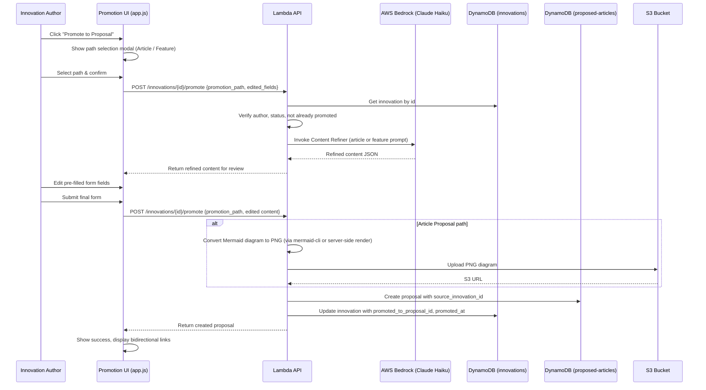

# Design Document: Innovation Promotion

## Overview

This feature adds a "Promote to Proposal" workflow that lets Innovation Hub authors convert their published innovations into formal proposals (either Builder.AWS Article Proposals or Service Feature Proposals). The system uses Bedrock Claude Haiku to transform innovation content into the structured proposal format, lets the author review and edit the AI draft, then creates the proposal with a bidirectional link back to the originating innovation.

The promotion flow is a single API call (`POST /innovations/{innovation_id}/promote`) that handles auth verification, ownership check, duplicate-promotion guard, AI content refinement, proposal creation, innovation record update, and (for article promotions) Mermaid-to-PNG diagram conversion stored in S3.

## Architecture



The promotion endpoint operates in two modes within a single request:
1. **Refine mode** (`refine_only: true`): Calls Bedrock, returns AI-refined content for the author to review. No records are created.
2. **Submit mode** (default): Validates edited content, creates the proposal, updates the innovation, and returns the final proposal.

This two-step approach keeps the frontend simple (two sequential calls to the same endpoint) while giving the author full editing control before committing.

## Components and Interfaces

### Backend Components

#### 1. Promote Innovation Endpoint

**Route**: `POST /innovations/{innovation_id}/promote`
**Auth**: `@require_auth` — caller must be the innovation author
**Request body**:
```json
{
  "promotion_path": "article" | "feature",
  "refine_only": true | false,
  "title": "...",
  "description": "...",
  "category": "...",
  "summary": "...",
  "outline": ["..."],
  "key_topics": ["..."],
  "target_audience": "...",
  "estimated_length": "...",
  "service": "...",
  "priority": "...",
  "use_case": "..."
}
```
- When `refine_only` is `true`, only `promotion_path` is required. The endpoint returns AI-refined content without creating any records.
- When `refine_only` is `false` (or absent), the edited fields are validated and the proposal is created.

**Response (refine mode)**:
```json
{
  "refined_content": { ... },
  "innovation": { ... }
}
```

**Response (submit mode)**:
```json
{
  "message": "Innovation promoted successfully",
  "proposal": { ... },
  "innovation": { ... }
}
```

#### 2. Content Refiner Functions

**`refine_innovation_to_article(innovation)`** — New function that builds a Bedrock prompt from the innovation's title, problem_statement, architecture_description, code_snippets, and a community feedback summary (upvotes, comment count). Returns the same JSON shape as `refine_article_proposal`: `{title, category, summary, outline, key_topics, target_audience, estimated_length}`.

**`refine_innovation_to_feature(innovation)`** — New function that builds a Bedrock prompt from the innovation's title, problem_statement, architecture_description, aws_services, and complexity_level. Returns the same JSON shape as `refine_feature_proposal`: `{refined_description, related_features, request_category}`.

Both functions include fallback logic matching the existing refiner pattern: if Bedrock fails, return a sensible default using the original innovation fields.

#### 3. Mermaid-to-PNG Converter

**`convert_mermaid_to_png(mermaid_code, innovation_id)`** — Converts a Mermaid.js code string to a PNG image. Uses the `mermaid-cli` (`mmdc`) binary bundled in a Lambda layer, or alternatively uses a headless Chromium approach via Puppeteer in a layer. Uploads the resulting PNG to S3 at `diagrams/{innovation_id}.png` and returns the S3 URL.

Fallback: If conversion fails, the `architecture_diagram_url` field is set to an empty string and the promotion still succeeds (non-blocking).

### Frontend Components

#### 4. Promotion UI (InnovationHub class extensions)

All changes apply to both `frontend/app.js` and `frontend/app-staging.js`.

**Promote Button**: Added to the innovation detail modal (`openDetail` method). Visible only when:
- User is authenticated
- User is the innovation author (`user_id` matches)
- Innovation status is `"published"`
- Innovation has no `promoted_to_proposal_id`

**Path Selection Modal**: A new modal with two cards ("Builder.AWS Article Proposal" and "Service Feature Proposal"), each with a brief description. Selecting one and clicking "Continue" triggers the refine API call.

**Review Form**: A pre-filled form matching the chosen path format. For articles: title, category dropdown, summary, outline (editable list), key topics, target audience, estimated length. For features: service dropdown, title, description, priority, use case. The author can edit all fields before submitting.

**Promoted Badge**: Innovation cards and the detail modal show a "📤 Promoted" badge when `promoted_to_proposal_id` is set.

**Bidirectional Links**:
- Innovation detail modal: "View Proposal" link when promoted
- Proposal detail view: "View Original Innovation" link when `source_innovation_id` is set

**Diagram Display**: For article proposals with `architecture_diagram_url`, the proposal detail view renders the PNG image and provides a "Download Diagram (PNG)" button.

## Data Models

### Innovation Record (updated fields)

Added to the existing `innovations` DynamoDB table item:

| Field | Type | Description |
|-------|------|-------------|
| `promoted_to_proposal_id` | String | The `proposal_id` of the resulting proposal. Absent/empty if not promoted. |
| `promoted_at` | String (ISO 8601) | UTC timestamp of when the promotion occurred. |

### Proposal Record (updated fields)

Added to the existing `proposed-articles` DynamoDB table item:

| Field | Type | Description |
|-------|------|-------------|
| `source_innovation_id` | String | The `innovation_id` of the originating innovation. Absent if not from promotion. |
| `architecture_diagram_url` | String | S3 URL of the PNG diagram (article promotions only). Empty string if conversion failed. |
| `architecture_diagram` | String | Mermaid.js code string carried forward (feature promotions only). |
| `code_snippets` | List | Array of `{language, code}` objects carried forward from the innovation. |

### Existing Fields Used (no changes)

**Innovation**: `innovation_id`, `user_id`, `title`, `problem_statement`, `architecture_description`, `architecture_diagram`, `code_snippets`, `aws_services`, `complexity_level`, `status`, `upvotes`, `downvotes`, `comment_count`

**Proposal (article)**: `proposal_id`, `proposal_type`, `user_id`, `display_name`, `title`, `description`, `category`, `ai_generated_content`, `status`, `votes`, `voters`, `created_at`, `updated_at`

**Proposal (feature)**: `proposal_id`, `proposal_type`, `user_id`, `display_name`, `service`, `title`, `description`, `priority`, `use_case`, `ai_generated_content`, `status`, `votes`, `voters`, `created_at`, `updated_at`


## Correctness Properties

*A property is a characteristic or behavior that should hold true across all valid executions of a system — essentially, a formal statement about what the system should do. Properties serve as the bridge between human-readable specifications and machine-verifiable correctness guarantees.*

### Property 1: Promote button visibility

*For any* innovation object and any viewer context (authenticated/unauthenticated, author/non-author, published/non-published, promoted/non-promoted), the "Promote to Proposal" button SHALL be visible if and only if the viewer is authenticated, is the innovation author, the innovation status is "published", and `promoted_to_proposal_id` is not set. When `promoted_to_proposal_id` is set, a "View Proposal" link SHALL be displayed instead.

**Validates: Requirements 1.1, 1.2, 1.3, 8.3, 9.2**

### Property 2: Refiner input completeness

*For any* innovation and any promotion path ("article" or "feature"), the Content Refiner prompt SHALL include all required innovation fields for that path. For article: title, problem_statement, architecture_description, code_snippets, and community feedback (upvotes, comment_count). For feature: title, problem_statement, architecture_description, aws_services, and complexity_level.

**Validates: Requirements 3.1, 4.1**

### Property 3: Refiner output completeness

*For any* innovation input (including when Bedrock fails), the Content Refiner SHALL return an object containing all required fields. For article path: title, category, summary, outline, key_topics, target_audience, estimated_length. For feature path: refined_description, related_features, request_category. On Bedrock failure, article fallback uses the original title, "Technical How-To" category, and problem_statement as summary; feature fallback uses empty strings.

**Validates: Requirements 3.2, 3.3, 4.2, 4.3**

### Property 4: Promotion validation consistency

*For any* set of edited proposal fields submitted through the promotion endpoint, the validation result SHALL match what the existing `POST /propose-article` or `POST /propose-feature` endpoint would produce for the same fields. If the existing endpoint would reject the input, the promotion endpoint SHALL also reject it, and vice versa.

**Validates: Requirements 5.3**

### Property 5: Bidirectional link creation

*For any* successful promotion, the created proposal SHALL have `source_innovation_id` equal to the originating innovation's `innovation_id`, AND the updated innovation SHALL have `promoted_to_proposal_id` equal to the new proposal's `proposal_id` and `promoted_at` set to a valid ISO 8601 UTC timestamp.

**Validates: Requirements 6.1, 6.2**

### Property 6: Article promotion diagram conversion

*For any* article-path promotion where the innovation has a non-empty `architecture_diagram`, the created proposal SHALL have an `architecture_diagram_url` field containing a valid S3 URL pointing to a PNG object in the expected bucket path.

**Validates: Requirements 6.3**

### Property 7: Regular proposals exclude diagram URL

*For any* proposal created through the standard `POST /propose-article` or `POST /propose-feature` endpoints (not through promotion), the `architecture_diagram_url` field SHALL NOT be present or SHALL be empty.

**Validates: Requirements 6.4**

### Property 8: Content carry-forward

*For any* promotion, the created proposal SHALL contain the innovation's `code_snippets` array. Additionally, for feature-path promotions, the proposal SHALL contain the innovation's `architecture_diagram` as a Mermaid.js code string.

**Validates: Requirements 6.5, 6.6**

### Property 9: Innovation status preservation

*For any* successful promotion, the innovation record's `status` field SHALL remain `"published"` after the promotion operation completes. Promotion SHALL NOT modify the innovation's status.

**Validates: Requirements 8.1**

### Property 10: Bidirectional navigation rendering

*For any* promoted innovation displayed in the Hub list, the rendered card SHALL include a visual "Promoted" badge. *For any* proposal with a `source_innovation_id` field, the rendered proposal view SHALL include a "View Original Innovation" link.

**Validates: Requirements 8.2, 9.1**

## Error Handling

### API Error Responses

| Condition | HTTP Status | Error Message |
|-----------|-------------|---------------|
| `innovation_id` not found | 404 | "Innovation not found" |
| Caller is not the innovation author | 403 | "Only the innovation author can promote" |
| Innovation already promoted | 409 | "Innovation has already been promoted to a proposal" |
| Innovation status is not "published" | 400 | "Only published innovations can be promoted" |
| Invalid `promotion_path` value | 400 | "promotion_path must be 'article' or 'feature'" |
| Edited fields fail validation | 400 | Same validation error messages as existing proposal endpoints |
| Bedrock API failure | N/A (non-blocking) | Fallback content used; promotion continues |
| Mermaid-to-PNG conversion failure | N/A (non-blocking) | `architecture_diagram_url` set to empty string; promotion continues |
| DynamoDB write failure | 500 | "Internal server error" with logged details |

### Fallback Strategies

- **Bedrock failure (article)**: Use innovation title as proposal title, "Technical How-To" as category, problem_statement as summary, generic outline `["Introduction", "Main Content", "Conclusion"]`.
- **Bedrock failure (feature)**: Use empty strings for refined_description, related_features, request_category.
- **Mermaid-to-PNG failure**: Set `architecture_diagram_url` to empty string. The proposal is still created. The frontend falls back to rendering the Mermaid code client-side if the URL is empty.
- **Innovation update failure after proposal creation**: Log the error. The proposal exists but the innovation lacks the back-link. A future reconciliation or manual fix can address this. The response should still return the created proposal with a warning.

### Frontend Error Handling

- All API errors display via `showNotification(message, 'error')`.
- Network failures show a generic "Failed to promote innovation. Please try again." message.
- Loading states on buttons prevent double-submission.

## Testing Strategy

### Unit Tests

Unit tests cover specific examples, edge cases, and error conditions:

- Promotion of a non-existent innovation returns 404
- Promotion by a non-author returns 403
- Promotion of an already-promoted innovation returns 409
- Promotion of a non-published innovation returns 400
- Invalid promotion_path returns 400
- Article fallback content when Bedrock mock raises an exception
- Feature fallback content when Bedrock mock raises an exception
- Mermaid-to-PNG failure results in empty `architecture_diagram_url` but successful promotion
- Promote button visibility for each combination of auth state, ownership, status, and promotion state (specific examples)

### Property-Based Tests

Property-based tests verify universal properties across randomized inputs. Use the **Hypothesis** library for Python (backend) and a suitable PBT library for JavaScript frontend tests if applicable.

Each property test must:
- Run a minimum of **100 iterations**
- Reference its design document property with a tag comment
- Tag format: **Feature: innovation-promotion, Property {number}: {property_text}**

Properties to implement:

1. **Feature: innovation-promotion, Property 1: Promote button visibility** — Generate random innovation objects with varying auth/ownership/status/promotion states. Assert button visibility matches the conjunction of all conditions.

2. **Feature: innovation-promotion, Property 2: Refiner input completeness** — Generate random innovation objects. For each promotion path, call the refiner function and assert the prompt string contains all required fields.

3. **Feature: innovation-promotion, Property 3: Refiner output completeness** — Generate random innovation objects. Mock Bedrock to return valid JSON or raise exceptions. Assert the output always contains all required keys with correct fallback values on failure.

4. **Feature: innovation-promotion, Property 4: Promotion validation consistency** — Generate random edited content fields. Run them through both the promotion validation and the existing endpoint validation. Assert identical accept/reject decisions.

5. **Feature: innovation-promotion, Property 5: Bidirectional link creation** — Generate random valid innovations and promotion requests. After promotion, assert the proposal has `source_innovation_id` and the innovation has `promoted_to_proposal_id` and `promoted_at`.

6. **Feature: innovation-promotion, Property 6: Article promotion diagram conversion** — Generate random innovations with non-empty Mermaid diagrams. After article promotion, assert `architecture_diagram_url` is a valid S3 URL.

7. **Feature: innovation-promotion, Property 7: Regular proposals exclude diagram URL** — Generate random proposal submissions through the standard endpoints. Assert `architecture_diagram_url` is absent or empty.

8. **Feature: innovation-promotion, Property 8: Content carry-forward** — Generate random innovations with code_snippets and architecture_diagram. After promotion, assert the proposal contains the same code_snippets. For feature path, assert the proposal contains the same architecture_diagram string.

9. **Feature: innovation-promotion, Property 9: Innovation status preservation** — Generate random valid innovations with status "published". After promotion, assert the innovation's status is still "published".

10. **Feature: innovation-promotion, Property 10: Bidirectional navigation rendering** — Generate random innovation objects with/without promoted_to_proposal_id and random proposals with/without source_innovation_id. Assert the rendering functions include the correct badges and links.

### Test Configuration

- **Backend**: Python + Hypothesis (already in use in the project based on `.hypothesis/` directory)
- **Frontend**: Manual testing for UI components; property tests focus on backend logic
- **Minimum iterations**: 100 per property test
- **Mocking**: Bedrock calls mocked with both success and failure scenarios; DynamoDB mocked with moto or similar; S3 mocked for diagram upload tests
